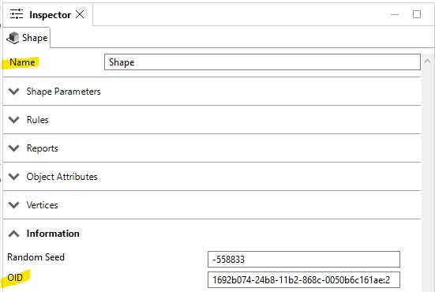

# Omniverse Connector Documentation

<iframe width="1024" height="606" src="https://www.youtube-nocookie.com/embed/seLhetGPyPs" title="YouTube video player" frameborder="0" allow="accelerometer; autoplay; clipboard-write; encrypted-media; gyroscope; picture-in-picture; web-share" allowfullscreen></iframe>

The Omniverse Connector for CityEngine provides an uni-directional link to Omniverse Nucleus. On top of the basic export functionality, repeated exports with the same name will accumulate using USD composition techniques. This allows for convenient tweaking of an exported model (e.g. updating a single building in a large city) without having to re-run full exports (which are potentially time-consuming).

{: width="100%" }

<iframe width="1024" height="606" src="https://www.youtube-nocookie.com/embed/52gGXj_t3TY" title="YouTube video player" frameborder="0" allow="accelerometer; autoplay; clipboard-write; encrypted-media; gyroscope; picture-in-picture; web-share" allowfullscreen></iframe>

## Installation Instructions

1. Install at least one of these CityEngine versions: 2022.0, 2022.1 or 2023.0. Please refer to [CityEngine - Get Started](https://doc.arcgis.com/en/cityengine/2023.0/get-started/cityengine-get-started.htm) for installation instructions.
1. Install the connector from the corresponding Omniverse Launcher item, see [Omniverse Launcher Overview](https://docs.omniverse.nvidia.com/prod_launcher/prod_launcher/overview.html) for additional information. You will be able to select into which CityEngine version(s) to install the connector.

## Usage Manual

The Omniverse Connector is available through a CityEngine model exporter and behaves like the default USD exporter. The only difference is that the USD data is sent to Nucleus instead of to disk.

### Sending Models to Omniverse

The typical steps to send a CityEngine scene to Omniverse are as follows:

1. In Cityengine, create layers and shapes and optionally assign CGA rules.
1. Select the desired layers, shapes and/or models.
1. Choose File -> Export Models... -> Omniverse Connector
1. Specify the desired Nucleus host name, path and export name, e.g. `myName`
1. Click finish.
1. The exported USD scene will be written to e.g. `/Users/CityEngine/myName`.
1. In Omniverse Create or View, either open the `/Users/CityEngine/myName/myName_root.usdc` file directly or add it as sub-layer or reference to an existing scene.

### Updating a prior export

To use the update functionality, first use Create or View to activate the "live mode" on the sub-layer or the layer which references the root USD file from CityEngine.

Note: in recent Omniverse Create/View apps there is no per-layer "live mode" anymore. Instead, a prompt will ask for layer reloading.

If the connector detects a prior export (e.g. `/Users/CityEngine/myCity/myCity_root.usdc`) on Nucleus with the same name (e.g. `myCity`), it will non-destructively layer the new models on top of the existing data and hide the outdated models. The data of each such iteration is placed in corresponding `edit` directories, e.g. `/Users/CityEngine/myCity/edit_1/`.

Note: to identify updated models between CityEngine and Omniverse, the connector concatenates the CityEngine `Shape Name` and `ObjectID` with an underscore `_` in between.

In above example, the resulting prim in Omniverse will be called `Shape_1692b074_24b8_11b2_868c_0050b6c161ae_2`.

### Export Option Reference

* `Nucleus Host`: host name of the Nucleus server (default: `localhost`).
* `Nucleus Path`: path on Nucleus server to store the exported USD data (default: `/Users/CityEngine`).
* `Base Name`: used to create a new directory below `Nucleus Path` with `<base name>_root.usdc` (the default value is derived from the current scene name).
* `Export Geometry`:
  * Models with Shape Fallback (Default): If model generation fails, it will export the start shape geometry.
  * Models: Ignore the shape, if the model generation fails.
  * Shapes: Only export the shape geometry.
* `Terrain Layers`: control the export of terrain layers based on selection. By default, all selected terrain layers will be exported.
* `Simplify Terrain Meshes`: If enabled, uses the CGA `reduceGeometry` operation to simplify the terrain geometry prior to export. This can take a long time, especially on higher resolution terrains (enabled by default).
* `Global Offset`: Offset the exported geometry. The `center` button will compute an offset so that the combined bounding box will be centered around the origin. This is useful to de-georeference a scene to prevent floating point precision issues in Omniverse. By default, no offset is applied.
* `Up Vector`: Sets the stage up-vector and transforms the CityEngine models accordingly. This is useful to work with AEC content which is typically stored as `z-Up`. Default is `z-Up`.
* `Triangulate Meshes`: If enabled, converts general polygons into triangles for proper rendering in Omniverse. Enabled by default.

Please also refer to the model export section in the [CityEngine Manual](https://doc.arcgis.com/en/cityengine/2023.0/help/help-export-models-overview.htm).

## Release Notes

### Version 1.0.3 (2023-06-15)

* New: Added support for CityEngine 2023.0
* Removed support for CityEngine 2021.1

### Version 1.0.2 (2023-03-11)

* New: Added support for CityEngine 2022.1.

### Version 1.0.1 (2022-10-19)

* New: Added support for CityEngine 2022.0.

### Version 1.0.0 (2022-04-30)

* New: Added triangulate option and enabled it by default.
* Changed: Models from identically named CityEngine layers will be added to the same USD prim.
* Bug Fix: Prevent crash when entering invalid base name characters.
* Bug Fix: Improve robustness if target path does not exist or user has insufficient permissions.

### Version 0.9.3 (2021-11-04)

* Fixed MSI installer to include modified USD encoder for correct prim naming.

### Version 0.9.2 (2021-11-03)

* Set stage units to centimeters and scale CityEngine geometry accordingly (Omniverse currently only supports centimeters).
* Add option to control "up" vector and transform CityEngine geometry accordingly.

### Version 0.9.1 (2021-10-29)

* Use "base name" to set default prim on root stage.
* Removed the useless ‘browse’ button for the server path.
* Removed option to configure the nucleus port (this value is hardcoded in Omniverse Nucleus).
* Allow the "@" character in the Server Path (useful for certain authentication schemes).
* Added input validation for the Nucleus host name (allowed characters are `0..9`, `a..z`, `A..Z`, `.-_`).

### Version 0.9.0 (2021-10-05)

* Initial export functionality to Nucleus
* Support partial updates by layering multiple exports with USD list edits

## Known Limitations

* Layering multiple exports on top of each other in live mode currently only works if the CityEngine root prim is not moved in the USD tree.
